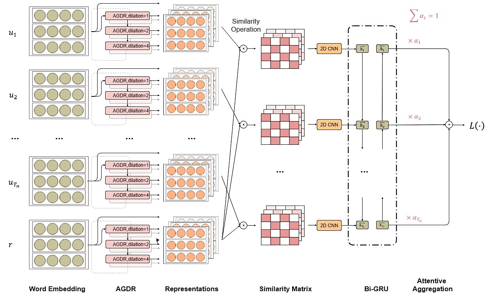
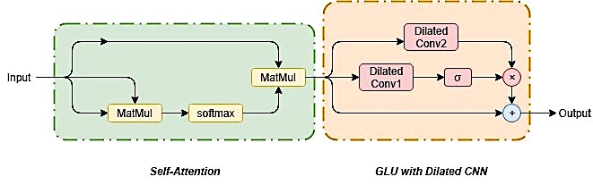
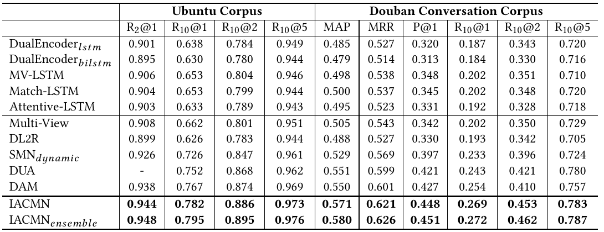

# __
__Iterated Attentive Convolution Matching Network (IACMN)__

This is an implementation of our CIKM 2019 paper: [Multi-Turn Response Selection in Retrieval-Based Chatbots with Iterated Attentive Convolution Matching Network].

## __Network__

IACMN is a neural deep matching network proposed for multi-turn response selection in the retrieval-based chatbot. 

IACMN iteratively constructs multi-grained representations of the response candidate and its multi-turn history context entirely based on hierarchical stacking of the proposed AGDR block, which is a refined combination of gated dilated-convolution and self-attention.

IACMN calculates and integrates the interaction matrices between each utterance-response pair from different views, then accumulate the sequencial matching vector into a fused vector to obtain the final score.

- **Model overview** 
<div align=center>

</div>

- **AGDR block** 
<div align=center>

</div>


## __Results__

We test IACMN on two large-scale multi-turn response selection tasks, i.e., the Ubuntu Corpus v1 and Douban Conversation Corpus, experimental results are bellow:



## __Usage__

First, please download [data](https://pan.baidu.com/s/1hakfuuwdS8xl7NyxlWzRiQ "data") and unzip it:
```
cd data
unzip data.zip
```

Train and test the model by:
```
sh run.sh
```

## __Dependencies__

- Python >= 2.7.3
- Tensorflow == 1.2.1

## __Citation__
If you use this code, please cite the following paper:

```
@inproceedings{ ,
  title={Multi-Turn Response Selection for Chatbots with Deep Attention Matching Network},
  author={Xiangyang Zhou, Lu Li, Daxiang Dong, Yi Liu, Ying Chen, Wayne Xin Zhao, Dianhai Yu and Hua Wu},
  booktitle={Proceedings of the 56th Annual Meeting of the Association for Computational Linguistics (Volume 1: Long Papers)},
  volume={1},
  pages={  --  },
  year={2018}
}
```
